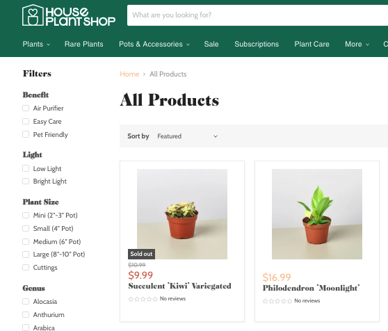
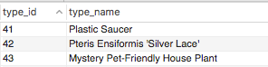
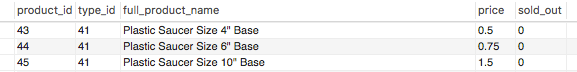
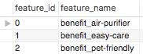
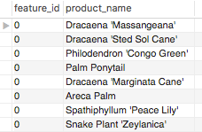
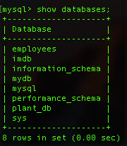
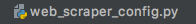
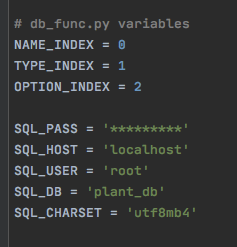

# House Plant Shop Webscraping Project
May 2021 (v3.0)

This webscraper (v3.0) is currently being developed by Sergio Drajner and
Isaac Misri as part of the ITC Data Science Fellows Program 

## Description
Plants and plant products are sold in many different varieties. Even
with filtering capabilities provided by web shops, often times it
can be difficult to sort through all products in an organized manner with
customized filters. The webscraper being developed is meant to extract 
relevant data about products and plants sold by House Plant Shop,
a large houseplant webshop located at 
https://houseplantshop.com/collections/all-products




## Setup
v3.0 of the webscraper is being developed using python and several packages
which can be found in the requirements.txt file. To set up the webscraper,
simply:
1. Download python or ensure that you have the latest version of 
python installed. For optimal use ensure you have python 3.9 or a later
version
2. Open the terminal or command line interface
3. Find the directory where the webscraper project is saved 
4. Use the package manager pip to install packages using 
requirements.txt
    ```
    pip3 install -r requirements.txt
    ```
5. Run the webscraper using the terminal or command line interface
by opening the web_scraper.py file. This will run the webscraper on all
its default values. To configure the setting of the webscraper. Read below
in the **CLI Commands** section
    ```
    python3 web_scraper.py
    ```

## CLI Commands
web_scraper.py v3.0 offers users much more flexibility by introducing
a CLI using python's click module. Users may now specify which sort
of information they would like to gather, where they would like to get the
data from, if and how to display it, whether to store the scraped data or not
and if so where, to enrich the database with information collected from an
API, and other options that are described below.

After typing
    
    python3 web_scraper.py
    
users may add from the following options/flags to filter and customize their search:

**--help / -h** option
    
    python3 web_scraper.py --help
The help option displays a message to the user, describing how each
flag and option works

**--version** option

    python3 web_scraper.py --version
The version option displays the version of the webscraper in use

**--product** option

Users may choose specific products to display with this option. If the product
being searched for is one word, no quotation marks are necessary. 
However if two or more words are being search for, quotation marks must be used.
If for example a user only wants to view products with succulent in
the product name, they could type the following command:

    python3 web_scraper.py --product succulent

If a user wants to view products with air plant in the product name, they could
use the following command:

    python3 web_scraper.py --product "air plant"

The product option is not case sensitive and the default is to search
for all products


**--feature** option

Users may choose to display products that have specific features 
with this option. The feature option works similarly to the product option.
If the feature being searched for is one word, no quotation marks are necessary. 
However if two or more words are being search for, quotation marks must be used.
If for example a user only wants to view products that have cactus as a feature
they could write:

    python3 web_scraper.py --feature cactus

Similar to the product option, the feature option is also not case sensitive
and the default is to search for all features

**--price / -p** option

Users may filter out products by price. After using the --price option,
insert a range (inclusive) of values using two numerical values. For example:
    
    python3 web_scraper.py --price 9.95 20.95
    
will return products whose prices are within the range of $9.95 and $20.95.
If no price is specified, the default is to search all prices


**--output / -o** option

Users have a choice to send the output of the webscraper to a csv file, 
json file or to an SQL database. The default for the output option is no output,
meaning that the data will not be stored. After using the --output option,
users may choose csv, json or db. If csv or json are selected, the output
files will be called products.csv/json and features.csv/json and they
will be stored in the same directory as the scripts.


**--sort / -s** option

Users may choose to have their data sorted by alphabetical order
or by price. The default is that the data will be unsorted.
They may also choose whether they want their data
to be in ascending or descending order. The default is ascending.
After using the --sort flag, users may choose one of the following options:

* n: sorts by name in ascending order
* p: sorts by price in ascending order 
* na: sorts by name in ascending order
* nd: sorts by name in descending order 
* pa: sorts by price in ascending order 
* pd: sorts by price in descending order

**--retries / -r** option

Occasionally, the request sent to access the html code of the url will not 
respond. The --retries flag allows users to specify how many times they
would like to attempt to access the url. The default value is stored in
a variable located in web_scraper_config.py

**--sleep / -sl** option

The sleep option allows users to specify the amount of time (in seconds)
to wait in between scraping attempts.
The default value is stored in a variable located in web_scraper_config.py

**--sold-out / -so, --not-sold-out / -nso** option

As products are constantly being updated, users may specify if they would
only like to display products that are not sold out or that have been sold out.
The default is to display all products

**--scrape/--no-scrape** flag

This flag allows users to perform a web scrape or to extract the data
from products.csv and features.csv files when --no-scrape is selected.
The csv files must be located in the same directory as the script.
Users may use this flag to be used later if they choose not to scrape.
The default is to scrape

**--verbose/--no-verbose** flag

Users may choose to have the dataframes created by the webscraper displayed 
to their screen or not. The default is True. Be aware that the entire dataframe
will be displayed in verbose mode with approximately 1000 entries.
To minimize this, please use a filter to display fewer results or 
use the --no-verbose flag to avoid displaying the dataframe at all.
To check the progress of the web scraper, please refer to the log file.

**--break-down/--no-breakdown** flag

This flag allows users to choose whether or not to display products by
feature or only display the products on their own. The default is no
breakdown. Some products may not be related to features. If no feature is 
requested to be filtered (i.e., --feature not used)  and --no-break-down is 
selected, all products (whether they have a feature or not) will be displayed.

**--enrich /--not-enrich** flag

This option will enrich the existing database with new entries collected 
from a public API. All 4 tables in the database will be updated 
with new information. The address for the API can be found in the 
web_scraper_config.py file.

**Examples of CLI commands**

    python3 web_scraper.py  
Will scrape all the features and all products and display the resulting data 
to the screen in an unsorted manner


    python3 web_scraper.py --no-scrape --break-down --sort nd --product planter --feature planter
Will retrieve the data from features.csv and products.csv files, 
filter out those features and products that contain 'planter', 
and display the products broken down by features, sorted by name in descending order

    python3 web_scraper.py -o db --no-screen 
Will scrape all features and products and write them in a database without displaying
the data to the screen

    python3 web_scraper.py --product succulent  --no-scrape  -s n --output csv -so 
Will retrieve the data from csv files and display succulent products that 
are sold out, sorted alphabetically in ascending order and write them 
(together with the corresponding features) to the products.csv and features.csv files.

    python3 web_scraper.py --no-scrape --product  evergreen      
Will return all products containing 'evergreen', unsorted, no matter 
if they have a feature or not, and displayed to the screen

## Logging
When running the webscraper for the first time, a log file will be
created and saved in the project folder. It will log the progress of the 
webscraper while it scrapes products and features. 
All subsequent scrapes will simply add new details to the log 
file which was already created after the first scrape. To view 
a new log file every time you scrape, simply delete the one that 
has been created from the previous scrape.
For detailed information about the webscraping processes 
please check the log file.


## SQL Database Layout
SQL was used to create a database that would store the 
product information scraped from the webshop. 
The database contains 4 tables:
1. general_product_names
2. all_products
3. features
4. features_prod_join

Before describing each table and its columns, some general
information about products and product types:

Every product scraped was given a unique product_id. However, many
different products can come from the same type of product. For example,
a Plastic Saucer comes in a 4", 6" and 10" sizes. In this case, 
the three products will have a unique product_id, but they will 
share the same type_id because they are all Plastic Saucers.

### general_product_names

general_product_names contains type_id and type_name columns. The
primary key for this table is type_id.
In this table, each unique type_id is matched with its 
corresponding product type. Using the Plastic Saucer example above,
this means that every Plastic Saucer will have the same type_id.



### all_products

all_products contains product_id, type_id, full_product_name,
price, and sold_out columns. The primary key for this table is product_id.
In this table, all the unique products with their unique product_ids
and non unique type_ids are recorded with their prices and whether 
or not they are sold out. Using the Plastic Saucer as an example
below, we see that all three Plastic Saucers have a unique product_id and share
the same type_id as they are all Plastic Saucers. Each one of their prices
is given and information about whether or not they are sold is provided
in the sold_out column by a boolean where 0 indicates False (not sold out)
and 1 indicates True (sold out)





Plants and products can also be searched by features. For example, the feature
"Air Purifier", includes many different plant types. 
The feature_prod_join table matches the many to many relationship between
the features and product types. 


### features

The features table contains feature_id and feature_name as columns. 
feature_id serves as the primary key. This table stores all the product features
on the webshop and assigns each of them a unique feature_id. 

   


### features_prod_join

The feature_prod_join table contains feature_id and type_name columns.
This table matches the many to many relationship between the features and 
product types.

   

For more information on the database layout please refers to the attached
ERD diagram (plant_db_ERD.pdf)


## SQL Database Usage
This section will serve as a walk-through to successfully integrate the
SQL database with the webscraper. Make sure you set up the database
before running the webscraper if you wish to store your data in an SQL
database.

1. Go to https://www.mysql.com/downloads/ and click on MySQL (GPL) 
Downloads

2. Click on MySQL Community Server

3. Download the version of MySQL suited for whatever OS you
are working with

4. Install the package that was downloaded and create a password

5. Locate the SQL directory and add it to the path variables

6. In the CLI, access MySQL with the following command and hit Enter:
    ```
    mysql -u root -p
    ```

7. At this point, you will be asked for your password that you created
earlier. Type in your password and hit Enter

8. Within the project repository there is a create_db.sql file.
Find the path to create_db.sql and run the following command in the CLI
   ```
   mysql > source path/to/create_db.sql
   ```

9. A new database named plant_db will be created. 
To check this, use the following command, and a list of databases will be returned
 
    
       
10. In the project files, open web_scraper_config.py

    
    
11. At the bottom of the page you will find constants that start with SQL
12. Fill in the relevant information for each variable. Your password
should be filled in SQL_PASS
    
    
    
13. Now you're all setup! Once you run the webscraper and select db for 
the --output option, your data will be recorded in the database!

## Problems encountered
While testing the program, few issues were encountered.
Occasionally when attempting to request the html code for the 
product features, a None response was returned when using grequests. 
The program was modified to continue running even when encountering this 
issue. If for whatever reason, the html code of a particular features page 
cannot be accessed, the user will be notified and the code will 
continue running without scraping through the inaccessible data.

Another similar issue was encountered when trying to access the html
code of each product. If the first request is unsuccessful,
the program will attempt to request the html code a number of times as
is specified by the default value defined in web_scraper_config.py file.
Users may specify the number of attempts as is discussed in the **CLI Commands**
section of this document. If these requests are unsuccessful, the program will 
disregard that particular product and will continue with the next products
and pages.

Additionally, the webshop modified their html code several times
before the third checkpoint and as such we were forced to make changes 
in our code to scrape data from their webpage. If you encounter any errors, 
they are very likely caused by changes and updates in the webshop's html code. 

Lastly, our original idea was to use the ebay API to compare prices of their
plants with the prices of plants scraped from the webshop. Unfortunately our 
request for an API token was never approved despite the site claiming 
it should take one business day. We searched for various APIs related 
to plants but they were also down or under maintenance. In the end we 
found a public API developed by growstuff.org. However in their 
documentation they mention that:

> At present there is no official API, as our site is still changing so rapidly. 
> However, we do expose some of our data via JSON and/or RSS feeds, and 
> you're welcome to play with it, on the understanding that it 
> may change under you. 

They have provided very limited information and query capabilities 
are non functional at this stage. As such, our code retrieves all the 
information available from the API.